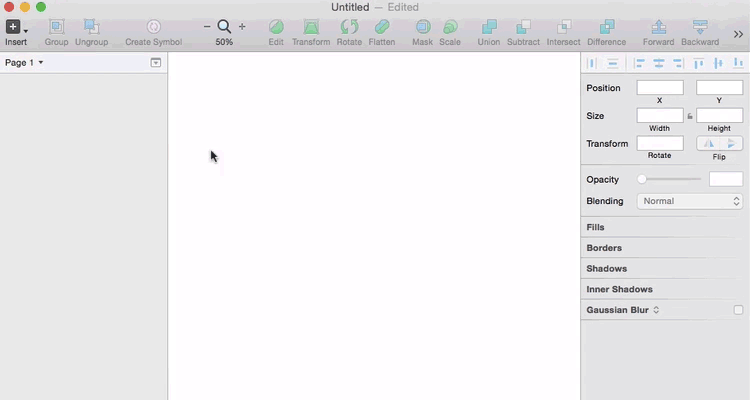
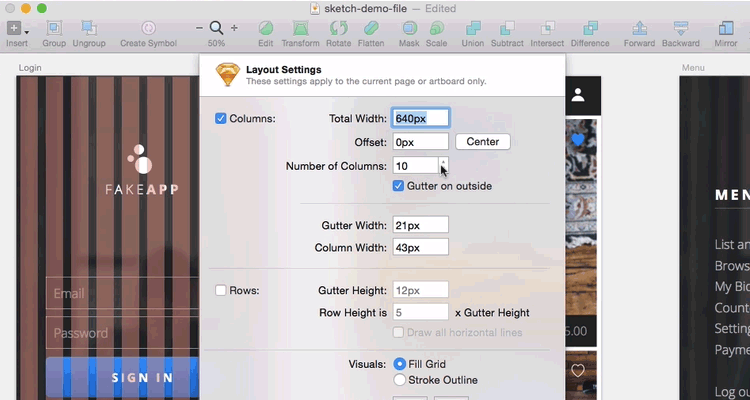
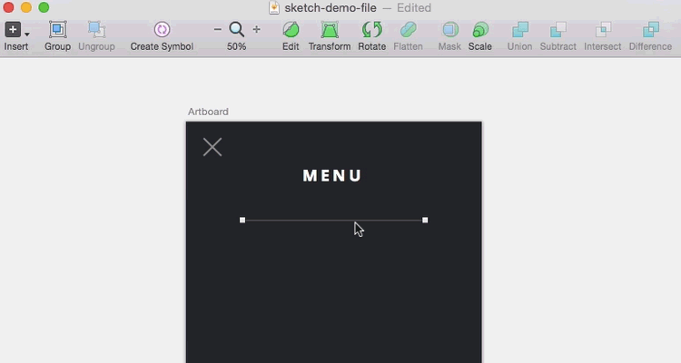
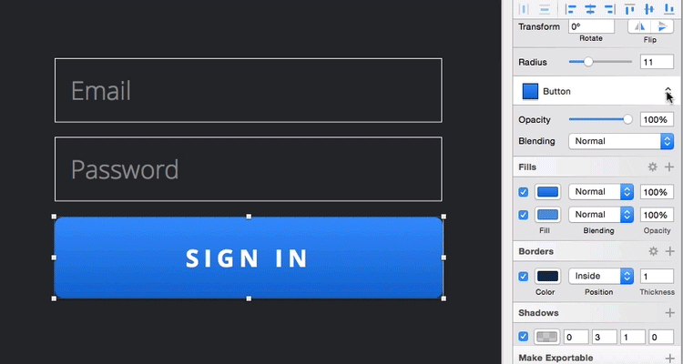
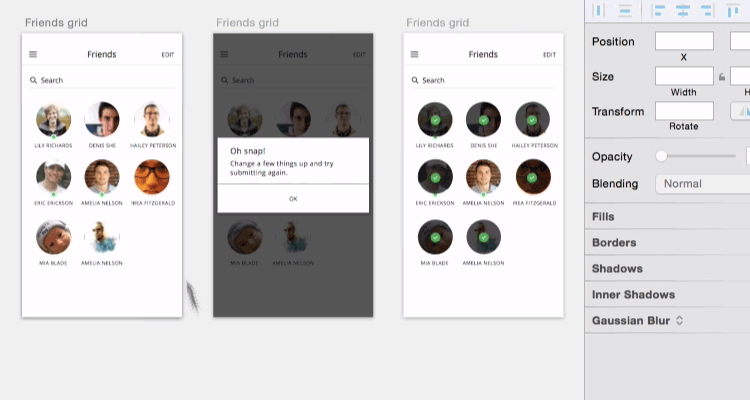
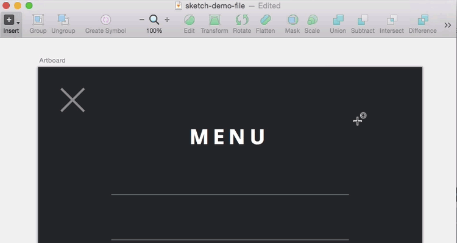
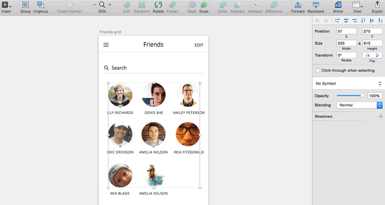
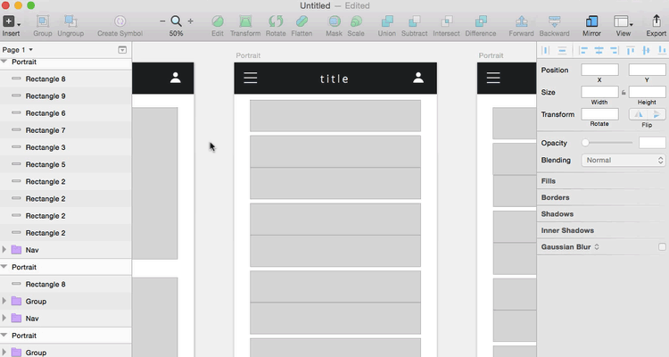

### sketch使用技巧

#### 1、选择画板

快捷键： A

菜单：Insert -> Artboard -> iPnone/Mobile

效果：

#### 2、栅格系统

快捷键： ctrl+L

菜单： View -> Layout -> Canvas -> show Grid / show Layout

效果：

#### 3、快速复制

按住option键，拖动你要复制的元素。再次使用Commend+D，可快速重复刚刚的复制操作。

效果：

#### 4、距离测算

选定元素，按住option键，移动到需要测距的元素上即可。

效果：

#### 5、共享样式

菜单： Layer -> create Shared Layer

作用：可以一键更改相同元素的样式

效果：

#### 6、Symbols

菜单： 选中元素 -> 右键 -> create Symbols

然后可以在`Insert -> Symbols`中找到你创建的Symbols

效果：

#### 7、绘制图形时拖拽

在绘制图形时，按住`空格键`，那么你就可以在创建好之后立刻移动它到对的位置，然后继续调整尺寸。

效果：

#### 8、快速改变透明度

快捷键： 1~0数字键

效果：

##### 9、`Scale`按钮

位置： 工具栏`Scale`按钮

作用： 快速调整元素的`Scale`，且是按比例来进行缩放的。

效果：

#### 10、工作空间调整

快捷键：

Ctrl+Option+Cmd+3  隐藏两边菜单

Ctrl+Option+Cmd+1  隐藏左边菜单

Ctrl+Option+Cmd+2  隐藏右边菜单

效果：

